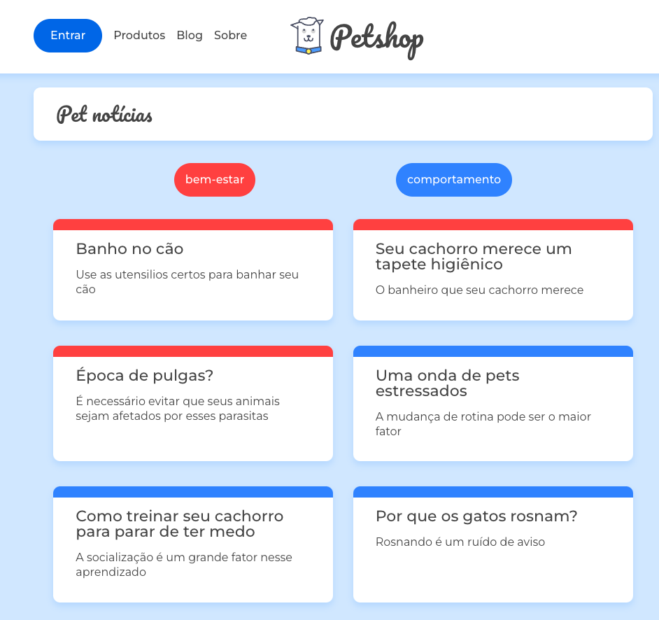

    
# PAGE PETBLOG
 

### First Page Login

### PETBLOG PAGE WITH FILTER AND SUBFILTER

 

    
     
# Technologies 

* JAVASCRIPT
* REACT JS

## Thanks for viewing my project.

Don't forget to follow me on Linkedin https://www.linkedin.com/in/rafael1807/
